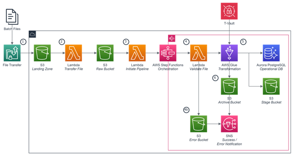
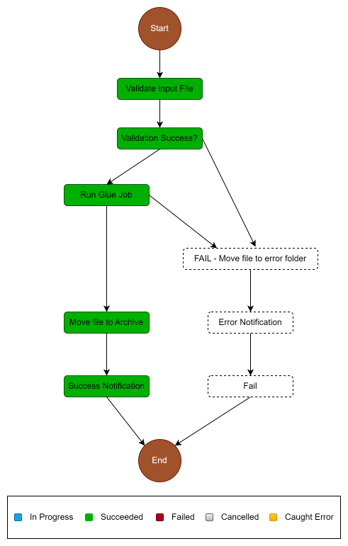
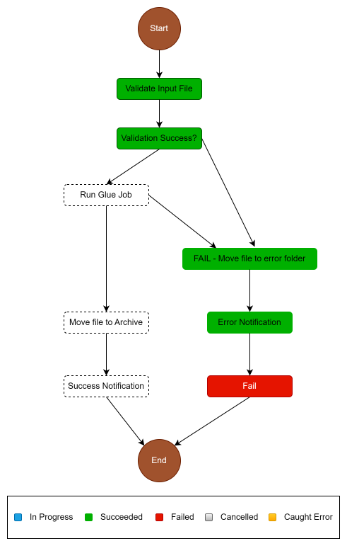

# Fintech ETL Pipeline with AWS Step Functions
This project houses the artifacts for the ETL pipeline in AWS using S3, Lambda, Glue, and Step Functions to transfer, validate, transform, compress, and partition daily batch data. This structure follows AWS prescriptive guidance for ETL pipeline orchestration found [here](https://docs.aws.amazon.com/prescriptive-guidance/latest/patterns/orchestrate-an-etl-pipeline-with-validation-transformation-and-partitioning-using-aws-step-functions.html#orchestrate-an-etl-pipeline-with-validation-transformation-and-partitioning-using-aws-step-functions-tools), and is adapted for the current use case.

The pipeline is orchestrated by serverless AWS Step Functions with error handling, retry and end user notification. When the batch files are uploaded to AWS S3 (Landing Zone bucket), the ETL pipeline is triggered. The pipeline first transfers the files to the Raw bucket, then starts the Step Functions to validated the data and schema, perform necessary transformations and compress to parquet format, transfer to the staging bucket and ultimately upload the data to the operational database (Aurora PostgreSQL) and initiate upsert/modify/delete SQL operations.

---

## Sections
- [Prerequisites](#Prerequisites)
- [Dependencies](#Dependencies)
- [Product Versions](#Product-Versions)
- [Architecture](#Architecture)
- [High level work flow](#High-level-work-flow)
- [Repository Structure](#Repository-Structure)
- [Deploy](#Deploy)
- [Test](#test)
- [Sample Workflow Execution](#Sample-Workflow-Execution-and-Notification)
- [Contributing](#contributing)

## Prerequisites 
* An active AWS account
* Creation and access to execution roles for AWS services (e.g., Lambda)
* AWS CLI
* .DAT dummy dataset with correct schema
* Web browser for access AWS console

## Dependencies
The deployment has the **current** dependency on AWS services already provisioned. These services are:
* S3 buckets and folder structure for: Landing Zone, Raw, Stage, Archive, Lambda Layers, and Error buckets
* Lambda functions for: file transfer, orchestration start, file validation, Glue job start, notifications, and RDS write
    * Lambda Layers assigned to required functions
* Step Function for pipeline orchestration
* AWS Glue for transformation operations
* SNS for triggers and email notifications
* Aurora PostgreSQL 14 (operational database)

Note that future versions of this might be deployed using AWS CloudFormation template or Terraform. In the current state, artifacts are deployed independently using CI/CD.

## Product Versions
* Python 3.10 for AWS Lambda
* AWS Glue version 3
* Aurora PostgreSQL 14 (serverless v2 scaling)

## Architecture

## High level work flow
1. COF batch files (e.g., daily account summary) are posted and secure file transfer is initiated to post files into S3 landing zone bucket.
2. A Lambda function contains a trigger listening for new file uploads (.dat format) in the S3 landing zone bucket. The function moves the file to the S3 raw bucket and deletes the file from the landing zone.
    * AWS Simple Notification Service (SNS) is used to determine when the batch file uploads occur and start the Lambda function as a trigger.
3. A Lambda function contains a trigger listening for new file uploads (.dat format) in the S3 raw bucket. This function initiates the AWS Step Function for ETL orchestration.
4. The first component of the step function is a Lambda function to validate the file. This validation will ensure the file is not empty and has other required components.
    * Should this fail, the file is moved to the S3 error bucket, and a notification is sent.
    * Should this pass, the lambda function runs the AWS Glue job.
    * NOTE: Catch and Retry logic exists here (TBD on final functionality).
5. The AWS Glue job:
    * Includes transformations for removal or irrelevant fields, data type confirmation / conversions, feature engineering, etc.
    * Stores data as .parquet file using PySpark – will store in parts (e.g., batch-file.parquet/part1.parquet) within S3 stage bucket.
    * Initiates the upsert procedures to move the data into the RDS and perform other operations (e.g., load into temporary table, then overwrite/update/append to existing operational tables).
        * Connection to RDS requires credentials stored in T-Vault (Temporarily using Secrets Manager until we determine how to connect T-Vault to AWS).
    * NOTE: Catch and Retry logic exists here (TBD on final functionality).
6. Upon successful completion of the upsert, the file is moved to the S3 archive bucket.

## Repository Structure
* template.yml - CloudFormation template file **(future state)**
* parameter.json - File that contains all the parameters and their respective values **(future state)**
* lambda - This folder contains the following lambda functions:
    * lz_to_raw.py - Transfer the batch files from Landing Zone into the Raw bucket
    * start_step_function.py - Starts the AWS Step Functions
    * validation.py - Validates input raw batch file data and schema
    * move_file.py - Moves batch file to error or archive S3 buckets
    * notification.py - Structures and sends notification for success or failure
* glue - This folder conatins the glue scripts for transforming the raw .dat batch files and compressing as parquet files
* notebooks - Notebooks for testing and ad hoc analysis
* sql - Schema for fintech backend
* roles_and_policies - AWS execution role JSONs and other pertinent policies
* state_machine.yml - AWS Step Function code for ETL orchestration object

## Deploy
**(future state)**

## Test
**(future state)**

---

## Sample Workflow Execution and Notification
### Successful Execution

### Failed Execution with input validation error

### Sample Success Notification
{"msg": "File uploaded to RDS and moved to archive: transactions", "executionname": "3d16677e-f159-4e42-ac7d-bc1b15b8310d", "status": "SUCCESS"}

### Sample Error Notification
{"msg": "File moved to error: transactions", "executionname": "47c4bcb8-9689-4a8d-b5f2-6ebec0e4f408", "status": "FAILURE"}

## Contributing
### Branching Strategy
The branching strategy we are using is **Feature Branching**

To start work on a feature/hotfix/bug first pull down `tmo/main` to get the lastest updated version of the code.

Create a branch from `tmo/main`, the branch name should follow the format of [JIRA-Ticket/Issue-Number]-FeatureDescription. E.g., SPE-173-Dummy-Data.

Once you have created your branch, complete your work and commit in increments with descriptive commit messages.

If there has been new commits to `tmo/main` make sure to checkout `tmo/main` and `git pull` to pull down the latest code from `tmo/main`, then checkout to your branch and merge `tmo/main` into your branch.

Then create a pull request.

When merging your PR, make sure you to select the "squash" (default) merge strategy to keep the commits for your feature branch unified into one commit on `tmo/main`.
